# Media Monitoring Pipeline Diagram

This file contains the Mermaid diagram visualizing the high-level architecture and processing pipelines described in [architecture.md](file:///c:/Programming/Projects/01_ACTIVE/media_tracking/docs/architecture.md). It displays the parallel text and live video ingestion/processing pipelines running alongside each other.

```mermaid
flowchart TB
    %% Styling and Class Definitions
    classDef source fill:#e1f5fe,stroke:#0288d1,stroke-width:2px,color:#01579b;
    classDef ingest fill:#e8f5e9,stroke:#388e3c,stroke-width:2px,color:#1b5e20;
    classDef processText fill:#fff3e0,stroke:#f57c00,stroke-width:2px,color:#e65100;
    classDef processVideo fill:#ede7f6,stroke:#7b1fa2,stroke-width:2px,color:#4a148c;
    classDef storage fill:#eceff1,stroke:#455a64,stroke-width:2px,color:#263238;
    classDef serving fill:#fce4ec,stroke:#c2185b,stroke-width:2px,color:#880e4f;
    classDef router fill:#ffebee,stroke:#d32f2f,stroke-width:2px,color:#b71c1c;

    %% --------------------------------------------------
    %% SOURCES SUBGRAPH
    %% --------------------------------------------------
    subgraph SOURCES ["📡 DATA SOURCES"]
        direction LR
        SrcX["X (Twitter) API v2<br/>(Filtered Stream & Search)"]:::source
        SrcNews["Pakistani News Sites<br/>(Dawn, Geo, ARY, Jang...)<br/>RSS / HTML"]:::source
        SrcYTLive["YouTube Live Streams<br/>(Live News/Talk Shows)"]:::source
        SrcVideo["RTSP / RTMP / HLS<br/>(CCTV, NVR, Broadcasts)"]:::source
    end

    %% --------------------------------------------------
    %% INGESTION LAYER SUBGRAPH
    %% --------------------------------------------------
    subgraph INGESTION ["⚙️ INGESTION LAYER"]
        direction TB
        subgraph INGEST_TEXT ["Text Path"]
            Fetchers["APIs & Scrapers<br/>(feedparser, Scrapy, Playwright)"]:::ingest
            MQ["Message Queue<br/>(Kafka / Redpanda)"]:::ingest
            Fetchers --> MQ
        end

        subgraph INGEST_VIDEO ["Video Path"]
            Connector["Stream Connector<br/>(FFmpeg / GStreamer)"]:::ingest
            Sampler["Frame Sampler<br/>(1 frame per X seconds)"]:::ingest
            Connector --> Sampler
        end
    end

    SrcX --> Fetchers
    SrcNews --> Fetchers
    SrcYTLive --> Connector
    SrcVideo --> Connector

    %% --------------------------------------------------
    %% PROCESSING LAYER (TEXT & VIDEO)
    %% --------------------------------------------------
    subgraph PROCESSING ["🧠 PROCESSING LAYER (Async Workers)"]
        direction TB

        %% Text Processing Pipeline
        subgraph TEXT_PIPE ["Text Processing Pipeline"]
            direction TB
            Normalizer["Text Normalizer<br/>(Deduplication & Spam Filter)"]:::processText
            LangID{"Language ID<br/>(FastText / Custom)"}:::processText
            NER["Named Entity Recognition<br/>(spaCy core / Transformer)"]:::processText
            Sentiment["Sentiment Classifier<br/>(mBERT / RoBERTa)"]:::processText
            TopicClustering["Topic Clustering<br/>(BERTopic + Multilingual)"]:::processText
            TrendDetect["Trend Detection<br/>(Volume & Velocity Spikes)"]:::processText

            Normalizer --> LangID
            LangID --> NER
            NER --> Sentiment
            Sentiment --> TopicClustering
            TopicClustering --> TrendDetect
        end

        %% Video Processing Pipeline
        subgraph VIDEO_PIPE ["Live Video Processing Pipeline"]
            direction TB
            subgraph VIDEO_TRACK ["Video Frame Analysis"]
                direction TB
                ObjDetect["Object Detection<br/>(YOLOv8n)"]:::processVideo
                FaceDetect["Face Detection<br/>(RetinaFace)"]:::processVideo
                FaceMatch["Face Match Against Gallery<br/>(InsightFace + FAISS/pgvector)"]:::processVideo
                SceneDetect["Scene Change Detection<br/>(PySceneDetect - CPU)"]:::processVideo

                ObjDetect --> FaceDetect --> FaceMatch --> SceneDetect
            end

            subgraph AUDIO_TRACK ["Audio Stream Analysis"]
                direction TB
                STT["Speech-to-Text<br/>(Faster-Whisper)"]:::processVideo
                Diarization["Optional Speaker Diarization<br/>(pyannote)"]:::processVideo

                STT --> Diarization
            end

            Aggregator["Event Aggregator<br/>(Timestamp-Align all Detections)"]:::processVideo
            EscRouter["Escalation Router<br/>(Watchlist Match / Low Conf?)"]:::router
            LLM_Fallback["Quality-Efficient Models / Local LLM<br/>(Qwen3 8B/14B, YOLOv8x, Whisper-Large)"]:::router

            VIDEO_TRACK --> Aggregator
            AUDIO_TRACK --> Aggregator
            Aggregator --> EscRouter
            EscRouter -- Yes --> LLM_Fallback
        end
    end

    MQ --> Normalizer
    Sampler --> VIDEO_TRACK
    Sampler --> AUDIO_TRACK

    %% --------------------------------------------------
    %% STORAGE LAYER SUBGRAPH
    %% --------------------------------------------------
    subgraph STORAGE ["🗄️ STORAGE LAYER"]
        direction LR
        Postgres[("PostgreSQL<br/>Relational DB<br/>(Structured Metadata)")]:::storage
        VectorDB[("Vector DB<br/>(pgvector / Qdrant)<br/>Semantic Search")]:::storage
        Elastic[("Elasticsearch / OpenSearch<br/>Full-Text & Aggregations")]:::storage
        S3Storage[("Object Storage<br/>(MinIO / S3)<br/>Flagged Frames")]:::storage
    end

    %% Routing from Processors to Storage
    TrendDetect --> Postgres
    TrendDetect --> Elastic
    TrendDetect --> VectorDB

    EscRouter -- No --> Postgres
    EscRouter -- No --> Elastic
    LLM_Fallback --> Postgres
    LLM_Fallback --> Elastic
    LLM_Fallback --> S3Storage

    %% --------------------------------------------------
    %% SERVING LAYER SUBGRAPH
    %% --------------------------------------------------
    subgraph SERVING ["📊 SERVING LAYER"]
        direction LR
        APIs["REST / GraphQL APIs"]:::serving
        Dashboard["Dashboard (React + Charts)<br/>Trends, Sentiment, Mentions"]:::serving
        Alerts["Alerting Engine<br/>Spike & Watchlist Alerts"]:::serving
    end

    Postgres --> APIs
    VectorDB --> APIs
    Elastic --> APIs

    APIs --> Dashboard
    APIs --> Alerts
```

