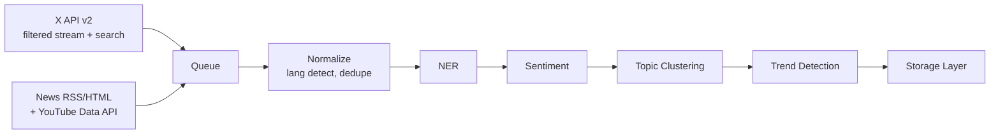
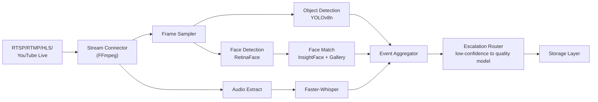

# Project Plan — Social Media Monitoring & Live Video Scanning Platform (Phase 1)

Module-wise division & phases for the **Social Media Monitoring Platform**, covering the current-focus scope: **Twitter/X + Pakistani digital media text monitoring** and **live-stream video scanning (object/face detection)**, both running as current-phase, high-priority workstreams. Full video metadata enrichment depth (subtitles, deep OCR, archival re-processing) is out of scope for this plan and tracked separately.

Reference: [architecture.md](./architecture.md) — full system design, model tables, and diagrams this plan implements.

---

## 0. Branch & Environment Strategy

| Branch | Purpose | Status |
|---|---|---|
| `main` | Stable scaffold (repo setup, shared infra config) | Active |
| `feature/text-pipeline` | X/Twitter + news ingestion, NLP pipeline | Active development |
| `feature/video-pipeline` | Live-stream ingestion, object/face detection | Active development, parallel to text pipeline |

**Rules**

- Text pipeline (M2–M5) and video pipeline (M6–M9) are built as **independent services** sharing only the Storage layer (M10) — a failure or delay in one does not block the other.
- All model configuration (which model runs per task, resource- vs. quality-efficient routing) lives in environment/config files, not hardcoded, so models can be swapped without code changes.
- GPU-resident services (video pipeline) and CPU/queue-based services (text pipeline) are deployed as separate containers from the start to avoid resource contention during development.

---

## 1. Module Map

| Module | Name | Lives in | Summary |
|---|---|---|---|
| **M0** | Infrastructure & DevOps | repo root, `docker-compose.yml`, `.github/workflows/` | Kafka/Redpanda, Postgres, Elasticsearch, MinIO scaffolding; CI for both pipelines |
| **M1** | Backend Core | `backend/app/core`, `api/` | Shared FastAPI app; config for X API keys, model endpoints, GPU device assignment |
| **M2** | X/Twitter Ingestion | `backend/app/services/ingestion/x_client.py` | Filtered stream + search via X API v2 |
| **M3** | Digital Media Ingestion | `backend/app/services/ingestion/news_scraper.py`, `youtube_client.py` | RSS/HTML scrapers for Pakistani news sites; YouTube Data API for channel/comment metadata |
| **M4** | Text NLP Pipeline | `backend/app/services/nlp/` | Language ID, NER, sentiment, topic clustering, trend detection (resource/quality-efficient routing) |
| **M5** | Text Pipeline Orchestrator | `backend/app/services/nlp/orchestrator.py` | Queue consumer wiring M2/M3 → M4 → Storage |
| **M6** | Video Stream Connector | `backend/app/services/video/stream_connector.py` | FFmpeg-based RTSP/RTMP/HLS/YouTube live ingestion, reconnect/retry logic |
| **M7** | Video Detection Models | `backend/app/services/video/detection/` | Object detection (YOLO), face detection/recognition (RetinaFace + InsightFace), scene detection |
| **M8** | Video Pipeline Orchestrator | `backend/app/services/video/orchestrator.py` | Frame sampling → detection tracks → event aggregation → escalation routing |
| **M9** | Face Gallery & Enrollment | `backend/app/services/video/face_gallery.py` | Enrollment API, embedding storage, FAISS/pgvector similarity search |
| **M10** | Storage Layer | `backend/app/db/`, `backend/app/services/storage/` | Postgres schema, Elasticsearch indices, MinIO buckets — shared by both pipelines |
| **M11** | Frontend | `frontend/src/` | Dashboard: trends/sentiment (text) + live-stream event feed (video) |
| **M12** | QA, Docs & Demo | `docs/`, `tests/` | Unit/integration tests, architecture doc sync, demo walkthrough |

---

## 2. Text Pipeline (Target Architecture Reference)



## 3. Video Pipeline (Target Architecture Reference)



*(Full diagrams with all stages: see architecture.md Section 1 and Section 4.)*

---

## 4. Phase Overview

| Phase | Modules | Goal |
|---|---|---|
| **Phase 0** — Infra & Scaffolding | M0, M1 | Repo, containers, queue, DB, config for both pipelines |
| **Phase 1** — Text Ingestion | M2, M3 | X API + news/YouTube ingestion flowing into queue |
| **Phase 2** — Text NLP Pipeline | M4, M5 | Language ID → NER → sentiment → topics → trends, resource/quality routing wired |
| **Phase 3** — Video Ingestion | M6 | Live stream connector stable across RTSP/RTMP/HLS/YouTube with reconnect logic |
| **Phase 4** — Video Detection | M7, M9 | Object + face detection running on sampled frames; face gallery enrollment working |
| **Phase 5** — Video Orchestration | M8 | Full event aggregation + escalation routing (resource → quality-efficient) |
| **Phase 6** — Storage & Frontend | M10, M11 | Unified storage schema; dashboard showing both text trends and live video events |
| **Phase 7** — QA & Docs | M12 | Tests, docs, demo |

---

## 5. Phase 0 — Infrastructure & Scaffolding

**Modules:** M0, M1

| Task | Detail |
|---|---|
| Repo scaffold | `docker-compose.yml` with Postgres, Kafka/Redpanda, Elasticsearch, MinIO, Redis (for face gallery cache) |
| Env vars | `X_API_BEARER_TOKEN`, `YOUTUBE_API_KEY`, `POSTGRES_URL`, `ES_URL`, `MINIO_*`, `GPU_DEVICE_ID`, `FACE_MATCH_THRESHOLD=0.5`, `OBJECT_DETECT_CONF_THRESHOLD=0.4` |
| Backend scaffold | `backend/app/core/config.py` — pydantic settings for all above |
| GPU allocation plan | Document which services claim GPU (video detection models) vs. CPU-only (text NLP fast-path) to avoid contention |
| CI | Separate pytest markers `@pytest.mark.text` and `@pytest.mark.video`; video tests mock GPU calls |

**Deliverable:** `docker-compose up` brings up all infra; health checks green; config loads for both pipelines.

---

## 6. Phase 1 — Text Ingestion (X + Digital Media)

**Modules:** M2, M3

### M2 — X/Twitter ingestion

| File | Responsibility |
|---|---|
| `x_client.py` | Filtered stream connection (keyword/hashtag rules) + periodic search backfill |
| `x_rules_manager.py` | CRUD for tracked keywords/hashtags/entities (watchlist) |

### M3 — Digital media ingestion

| File | Responsibility |
|---|---|
| `news_scraper.py` | RSS parsing (`feedparser`) + HTML fallback (`Playwright`) for Pakistani news sites listed in architecture.md Section 7 |
| `youtube_client.py` | YouTube Data API — channel metadata, comments, live chat where available |

### Tasks

- [ ] `XStreamClient.connect(rules) -> AsyncIterator[RawPost]`
- [ ] `NewsScraper.fetch(source_config) -> list[RawArticle]`, respecting `robots.txt` per source
- [ ] Watchlist management API (add/remove tracked keywords/entities)
- [ ] All raw events pushed to Kafka topic `raw-text-events`
- [ ] Roman Urdu flag: tag source language hint at ingestion time (site-level default) to assist downstream language ID

**Deliverable:** Raw X posts and news/YouTube content flowing into the queue continuously.

---

## 7. Phase 2 — Text NLP Pipeline

**Modules:** M4, M5

### M4 — NLP components (resource/quality-efficient routing per architecture.md Section 5)

| File | Responsibility |
|---|---|
| `lang_id.py` | fastText lid.176 (resource) + Roman Urdu heuristic/classifier (quality) |
| `ner.py` | spaCy fast-path + LLM fallback for low-confidence/code-switched text |
| `sentiment.py` | mBERT fast-path + local LLM (Qwen3) for ambiguous cases |
| `topic_clustering.py` | BERTopic with multilingual embeddings |
| `trend_detector.py` | Volume/velocity spike detection per keyword/entity |

### M5 — Orchestrator

| File | Responsibility |
|---|---|
| `orchestrator.py` | Kafka consumer: `raw-text-events` → normalize → NER → sentiment → topics → trends → Storage |

### Tasks

- [ ] Confidence-based escalation: each stage tags output with confidence; below threshold routes to quality-efficient model
- [ ] `NlpResult` schema: entities, sentiment, topic_id, language, confidence per field
- [ ] Unit tests with mocked model calls for routing logic (does low confidence actually escalate?)
- [ ] Roman Urdu test set: minimum labeled sample to validate lang ID + sentiment before wider rollout

**Deliverable:** End-to-end: a raw X post or news article produces entities, sentiment, topic, and trend signal in Storage.

---

## 8. Phase 3 — Video Ingestion (Live Stream Connector)

**Modules:** M6

| File | Responsibility |
|---|---|
| `stream_connector.py` | FFmpeg-based connection handling for RTSP, RTMP, HLS/M3U8, HTTP(S), YouTube Live |
| `reconnect_manager.py` | Retry/backoff logic for dropped streams; alerting on repeated failures |
| `frame_sampler.py` | Configurable sampling rate (default: 1 frame per 1–3 sec) |

### Tasks

- [ ] `StreamConnector.connect(source_url, protocol) -> FrameStream`
- [ ] Reconnect with exponential backoff; log/alert after N consecutive failures
- [ ] Frame sampling rate configurable per-stream (tunable per use case, per architecture.md Section 4.2 note)
- [ ] Audio track extraction in parallel with video frames
- [ ] Isolate each active stream in its own worker/process so one stream's failure doesn't block others

**Deliverable:** Stable connection + frame/audio extraction from at least one live RTSP/RTMP/HLS test source, with automatic reconnect verified under simulated drops.

---

## 9. Phase 4 — Video Detection Models & Face Gallery

**Modules:** M7, M9

### M7 — Detection models

| File | Responsibility |
|---|---|
| `object_detector.py` | YOLOv8n (resource) / YOLOv8x (quality) — object/logo detection |
| `face_detector.py` | RetinaFace (resource) — face detection on sampled frames |
| `face_recognizer.py` | InsightFace ArcFace embeddings (quality) — identity matching |
| `scene_detector.py` | PySceneDetect — shot/scene change flagging |
| `stt_client.py` | Faster-Whisper (resource: small/medium, quality: large-v3) |

### M9 — Face gallery

| File | Responsibility |
|---|---|
| `face_gallery.py` | Enrollment API — add reference photos, compute/store averaged embeddings |
| `similarity_search.py` | FAISS/pgvector nearest-neighbor lookup against enrolled gallery |

### Tasks

- [ ] `ObjectDetector.detect(frame) -> list[Detection]`
- [ ] `FaceDetector.detect(frame) -> list[FaceBox]`
- [ ] `FaceRecognizer.embed(face_crop) -> np.ndarray`
- [ ] `FaceGallery.enroll(person_name, images: list) -> embedding_id`
- [ ] `FaceGallery.match(embedding, threshold=0.5) -> MatchResult | None`
- [ ] Load testing: confirm concurrent detection throughput on target GPU (RTX 3090) at chosen frame sampling rate
- [ ] Legal/compliance checklist item: enrollment requires documented consent basis before production use (flag per architecture.md Section 9.1)

**Deliverable:** Given a sampled frame, the system returns detected objects, detected faces, and — if matched — identified person names from the gallery.

---

## 10. Phase 5 — Video Pipeline Orchestration & Escalation

**Modules:** M8

| File | Responsibility |
|---|---|
| `orchestrator.py` | Wire M6 → M7 (parallel tracks) → event aggregation |
| `event_aggregator.py` | Merge object/face/audio/scene detections into timestamped events |
| `escalation_router.py` | Route low-confidence/watchlist matches to quality-efficient models |

### Tasks

- [ ] Orchestrator loop per stream:

```text
for frame in frame_sampler.stream(source):
    objects = object_detector.detect(frame)        # resource-efficient
    faces = face_detector.detect(frame)             # resource-efficient
    for face in faces:
        match = face_gallery.match(face.embedding)
        if match is None or match.confidence < THRESHOLD:
            match = face_recognizer.full_match(face, gallery)  # quality-efficient escalation
    scene_event = scene_detector.check(frame)
    event = event_aggregator.merge(objects, faces, scene_event, timestamp=frame.ts)
    if event.has_watchlist_match or event.low_confidence:
        event = escalation_router.reprocess(event, frame)      # e.g. YOLOv8x, full InsightFace
    storage.save(event)
```

- [ ] Flagged frame snapshots saved to MinIO with event reference
- [ ] Structured JSON logging per event (stream_id, timestamp, detection type, confidence, model used)
- [ ] Config-driven thresholds (no hardcoded confidence values)

**Deliverable:** Full live-stream scanning pipeline running end-to-end on a test stream, producing timestamped, searchable events with correct resource/quality escalation behavior.

---

## 11. Phase 6 — Storage Layer & Frontend

**Modules:** M10, M11

### M10 — Storage schema

| Component | Responsibility |
|---|---|
| Postgres tables | `text_events`, `video_events`, `entities`, `face_gallery`, `streams`, `watchlists` |
| Elasticsearch indices | `text-search-index`, `video-event-index` — full-text + faceted filters |
| MinIO buckets | `flagged-frames`, `archived-clips` (future) |

### M11 — Frontend

| Task | Detail |
|---|---|
| Text dashboard | Trend charts, sentiment breakdown, entity mention feed |
| Video dashboard | Live event feed (object/face detections with timestamps), stream health status |
| Alerting UI | Keyword spikes, sentiment drops, watchlist face/object matches |
| Unified search | Cross-pipeline search (text + video events) via shared Elasticsearch layer |

### Tasks

- [ ] Finalize Postgres schema migrations for both pipelines
- [ ] Elasticsearch index mappings with proper analyzers for Urdu/English mixed text
- [ ] Dashboard wired to both `/api/text/*` and `/api/video/*` endpoints
- [ ] Alert rules configurable per keyword/entity/watchlisted face

**Deliverable:** Single dashboard showing live trends from text pipeline and live event feed from video pipeline, both queryable from one search bar.

---

## 12. Phase 7 — Testing, Documentation & Demo

**Modules:** M12

| Task | Detail |
|---|---|
| Unit tests | Mock model calls; test confidence-based escalation logic, face gallery matching math, reconnect/backoff logic |
| Integration tests | Real Postgres/Elasticsearch + mocked models; one text-pipeline flow, one video-pipeline flow end-to-end |
| Load tests | Concurrent stream count on target GPU before frame-drop/backlog occurs (validates architecture.md Section 9.3 hurdle) |
| Security/compliance | Face enrollment consent flow documented; no API keys/tokens leaked in logs |
| Docs | Sync `architecture.md` with any implementation deviations |
| Demo script | 1 X/keyword trend example, 1 news-sentiment example, 1 live-stream object/face detection example with watchlist match |
| README | Setup steps for both pipelines, env vars, GPU requirements |

**Deliverable:** Green CI for both `@pytest.mark.text` and `@pytest.mark.video`; updated architecture doc; demo recording covering both pipelines.

---

## 13. What's Different Between the Two Pipelines (Summary)

| Area | Text Pipeline | Video Pipeline |
|---|---|---|
| Latency tolerance | Seconds–minutes (queue-based) | Near-real-time (frame-by-frame) |
| Compute profile | Mostly CPU, occasional GPU (LLM escalation) | GPU-resident per active stream |
| Failure mode | Retry from queue | Reconnect/backoff on dropped stream |
| Concurrency limit | Scales with worker count | Hardware-bound (GPU VRAM/compute) |
| Escalation trigger | NLP confidence score | Detection confidence + watchlist match |
| Data sources | X API, RSS/HTML, YouTube Data API | RTSP/RTMP/HLS/YouTube Live |
| Primary storage | Postgres + Elasticsearch (text) | Postgres + Elasticsearch (events) + MinIO (frames) |

---

## 14. Risks & Mitigations

| Risk | Mitigation |
|---|---|
| X API cost scaling past budget at monitoring volume | Track read/write counts against budget in real time; alert before hitting 2M-read cap (architecture.md Section 9.1) |
| Roman Urdu misclassification degrading NLP accuracy | Build labeled test set early (Phase 2); don't wait for production data to discover the gap |
| Single-GPU concurrency ceiling limits live-stream count | Load test in Phase 4/5 to get a real number; document cloud-burst plan even if not implemented yet |
| Stream instability (RTSP/RTMP drops) causing silent data gaps | Reconnect/backoff logic + alerting in Phase 3, tested against simulated drops before Phase 4 |
| Face recognition accuracy lower in real-world footage than benchmarks | Validate against real sample footage (not just clean photos) before relying on match confidence thresholds |
| Face enrollment legal/compliance gap | Explicit checklist item in Phase 4; block production enrollment until consent basis is documented |
| Two pipelines diverging in storage schema assumptions | M10 schema designed jointly in Phase 0 planning, reviewed by both pipeline owners before Phase 6 |
| News site scraper breakage (site structure changes) | Per-source health check + alerting; scraper config isolated per site for quick fixes |

---

## 15. Configuration Reference

| Setting | Env var | Default |
|---|---|---|
| X API bearer token | `X_API_BEARER_TOKEN` | — |
| YouTube API key | `YOUTUBE_API_KEY` | — |
| Postgres URL | `POSTGRES_URL` | — |
| Elasticsearch URL | `ES_URL` | — |
| MinIO endpoint/keys | `MINIO_ENDPOINT`, `MINIO_ACCESS_KEY`, `MINIO_SECRET_KEY` | — |
| GPU device ID | `GPU_DEVICE_ID` | `0` |
| Frame sampling interval | `VIDEO_FRAME_SAMPLE_SEC` | `2` |
| Object detection confidence threshold | `OBJECT_DETECT_CONF_THRESHOLD` | `0.4` |
| Face match similarity threshold | `FACE_MATCH_THRESHOLD` | `0.5` |
| Sentiment escalation confidence threshold | `SENTIMENT_ESCALATION_THRESHOLD` | `0.6` |
| NER escalation confidence threshold | `NER_ESCALATION_THRESHOLD` | `0.6` |
| Max stream reconnect attempts | `STREAM_MAX_RECONNECT` | `5` |
| Reconnect backoff base (sec) | `STREAM_RECONNECT_BACKOFF_S` | `2` |

---

## 16. Suggested Timeline

| Phase | Duration (suggested) |
|---|---|
| Phase 0 — Infra & scaffolding | 1 day |
| Phase 1 — Text ingestion | 1.5 days |
| Phase 2 — Text NLP pipeline | 2 days |
| Phase 3 — Video ingestion | 1.5 days |
| Phase 4 — Video detection & face gallery | 2.5 days |
| Phase 5 — Video orchestration & escalation | 1.5 days |
| Phase 6 — Storage & frontend | 2 days |
| Phase 7 — QA & docs | 1.5 days |

**Total:** ~13.5 days sequential (Text and Video phases can run in parallel with separate owners, reducing wall-clock time to roughly ~8–9 days)

---

## 17. Related Docs

- [architecture.md](./architecture.md) — full system design, diagrams, model justification tables (Section 5), and hurdles (Section 9)